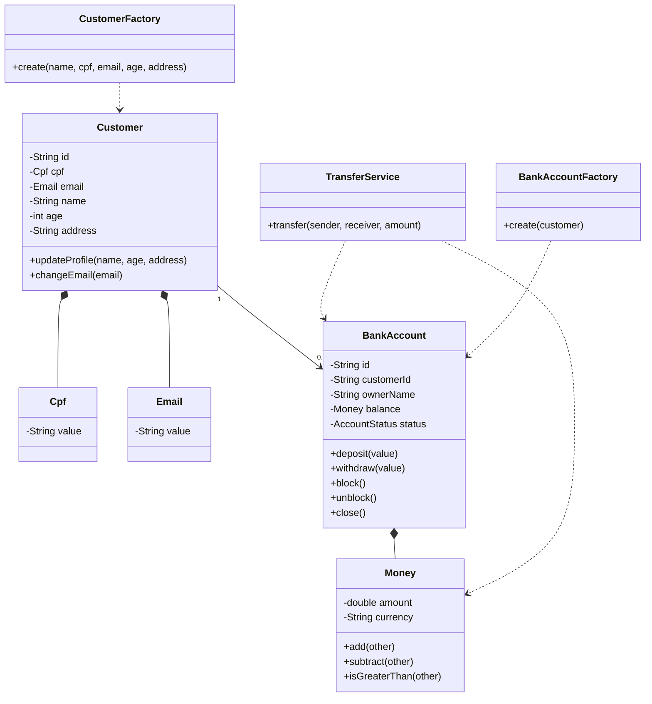

# Entrega Final do Projeto

## 1. Identificação do projeto

- **Nome do projeto:** ZecaUrubank
- **Integrantes do grupo:** Matheus Araujo Ferreira
- **Link do repositório:** https://github.com/matheusodete/ZecaUrubank/tree/main
- **Tecnologia utilizada:** Android nativo com Java, Firebase Authentication e Firebase Firestore
- **Funcionalidade principal desenvolvida:** aplicativo bancário mobile com cadastro, login, tela principal, área de investimentos e modelagem de domínio para cadastro de cliente, abertura de conta e transferência bancária.

## 2. Descrição do case

O ZecaUrubank representa um aplicativo bancário digital. O case principal envolve o cadastro de clientes, autenticação, consulta de dados do usuário, navegação por funcionalidades bancárias e organização do domínio para operações financeiras, como conta bancária, saldo, depósito, saque e transferência.

O problema de negócio resolvido pelo projeto é permitir que um cliente utilize uma conta digital de forma simples, protegendo regras essenciais do domínio bancário, principalmente a criação de clientes válidos, abertura de conta, controle de saldo e movimentação de dinheiro.

## 3. Estado do projeto antes da análise externa

Antes da consolidação final, o projeto possuía telas Android conectadas ao Firebase, porém grande parte das regras estava concentrada em Activities e em estruturas simples. A refatoração inicial já havia criado uma camada `Domain`, uma camada `Application` e uma camada `Infrastructure`, mas o domínio ainda estava reduzido ao módulo de contas, com poucas invariantes e pouca documentação.

## 4. Alterações realizadas pelo outro grupo

As principais alterações recebidas foram:

- criação inicial da camada de domínio;
- criação da entidade `BankAccount`;
- criação do Value Object `Money`;
- criação do serviço de domínio `TransferService`;
- criação do repositório abstrato `IBankAccountRepository`;
- criação da implementação em memória `InMemoryBankAccountRepository`;
- criação do caso de uso `TransferMoneyUseCase`;
- criação do documento `README_DDD.md`.

## 5. Avaliação das alterações recebidas

As alterações de separação em camadas foram mantidas, pois faziam sentido para o projeto e aproximavam o código dos conceitos de DDD. A entidade `BankAccount`, o Value Object `Money`, o serviço de transferência e o repositório abstrato foram preservados, porém receberam ajustes.

Foram modificadas as regras de `Money`, porque o Value Object precisava ser mais expressivo, imutável e com igualdade por valor. Também foram reforçadas as invariantes de `BankAccount`, incluindo status de conta, bloqueio, encerramento e validação de operações.

Não foram rejeitadas as ideias principais da refatoração externa, mas algumas implementações foram complementadas por estarem incompletas para a Entrega 3.

## 6. Melhorias adicionais realizadas pelo grupo original

Foram realizadas as seguintes melhorias finais:

- criação do módulo `Customers` para representar cliente bancário;
- criação da entidade `Customer`;
- criação dos Value Objects `Cpf` e `Email`;
- criação da `CustomerFactory`;
- criação da interface `ICustomerRepository`;
- criação da implementação `InMemoryCustomerRepository`;
- criação do caso de uso `RegisterCustomerUseCase`;
- reforço do Aggregate `BankAccount`;
- inclusão do enum `AccountStatus`;
- melhoria das regras de transferência;
- adição de testes unitários para regras de domínio;
- criação deste documento obrigatório de entrega final.

## 7. Linguagem Ubíqua

| Termo | Significado |
|---|---|
| Cliente | Pessoa cadastrada no banco digital |
| CPF | Documento usado para identificar unicamente um cliente |
| E-mail | Canal de contato e dado usado no cadastro/autenticação |
| Conta Bancária | Conta digital pertencente a um cliente |
| Titular | Cliente responsável por uma conta |
| Saldo | Valor disponível na conta |
| Depósito | Entrada de dinheiro em uma conta ativa |
| Saque | Retirada de dinheiro de uma conta ativa |
| Transferência | Movimentação de dinheiro entre duas contas diferentes |
| Conta Ativa | Conta habilitada para operações financeiras |
| Conta Bloqueada | Conta temporariamente impedida de realizar movimentações |
| Conta Encerrada | Conta finalizada, sem possibilidade de reativação |

## 8. Módulos

### Accounts

Responsável pelas regras de conta bancária e movimentações financeiras.

Classes principais:

- `BankAccount`
- `Money`
- `AccountStatus`
- `TransferService`
- `BankAccountFactory`
- `IBankAccountRepository`
- `InMemoryBankAccountRepository`

### Customers

Responsável pelas regras de cadastro e identificação de clientes.

Classes principais:

- `Customer`
- `Cpf`
- `Email`
- `CustomerFactory`
- `ICustomerRepository`
- `InMemoryCustomerRepository`

### Application

Responsável por coordenar casos de uso, sem conter regra central de negócio.

Classes principais:

- `TransferMoneyUseCase`
- `RegisterCustomerUseCase`
- `TransferDTO`
- `RegisterCustomerDTO`

### Presentation/API Android

Responsável pelas telas e interação com o usuário.

Classes principais:

- `MainActivity`
- `cadastro`
- `login`
- `tela_principal`
- `tela_invest`
- `tela_opcao`
- `fundo_invest`

## 9. Entities

### Customer

- **Identidade:** `id`
- **Responsabilidades:** representar o cliente do banco, manter CPF, e-mail, nome, idade e endereço válidos.
- **Comportamentos:** `updateProfile` e `changeEmail`.
- **Regras de negócio:** cliente deve ter nome válido, ser maior de idade, possuir endereço, CPF e e-mail válidos.
- **Ciclo de vida:** nasce no cadastro, pode atualizar perfil e e-mail.
- **Justificativa:** é Entity porque possui identidade própria e ciclo de vida independente dos seus atributos.

### BankAccount

- **Identidade:** `id`
- **Responsabilidades:** controlar saldo, status e operações financeiras.
- **Comportamentos:** `deposit`, `withdraw`, `block`, `unblock` e `close`.
- **Regras de negócio:** não permitir saldo negativo, não permitir operação com valor zero, impedir movimentação em conta bloqueada ou encerrada e permitir encerramento apenas com saldo zerado.
- **Ciclo de vida:** criada ativa, pode ser bloqueada, desbloqueada ou encerrada.
- **Justificativa:** é Entity e Aggregate Root porque possui identidade, ciclo de vida e protege as invariantes de saldo e status.

## 10. Value Objects

### Money

- **Atributos:** `amount` e `currency`.
- **Validações:** valor não pode ser negativo, infinito ou inválido; moeda é obrigatória.
- **Regras protegidas:** não permite operações entre moedas diferentes e não permite subtração que gere valor negativo.
- **Critérios de igualdade:** igualdade por `amount` e `currency`.
- **Justificativa:** representa um valor monetário, não possui identidade e é imutável.

### Cpf

- **Atributos:** `value`.
- **Validações:** deve possuir 11 dígitos e não pode ser uma sequência repetida.
- **Regras protegidas:** impede cadastro com CPF estruturalmente inválido.
- **Critérios de igualdade:** igualdade pelo número normalizado.
- **Justificativa:** CPF é definido pelo próprio valor e não por identidade interna.

### Email

- **Atributos:** `value`.
- **Validações:** deve ter formato válido e não pode ser vazio.
- **Regras protegidas:** impede cadastro ou alteração para e-mail inválido.
- **Critérios de igualdade:** igualdade pelo e-mail normalizado em letras minúsculas.
- **Justificativa:** e-mail é um conceito de valor, sem identidade própria.

## 11. Aggregates e Aggregate Roots

### Aggregate Customer

- **Aggregate Root:** `Customer`
- **Objetos internos:** `Cpf` e `Email`
- **Fronteira de consistência:** dados cadastrais do cliente.
- **Invariantes:** cliente deve possuir CPF válido, e-mail válido, nome válido, idade mínima e endereço.
- **Operações controladas pela raiz:** atualização de perfil e troca de e-mail.
- **Objetos fora do Aggregate:** `BankAccount`, pois a conta possui ciclo de vida próprio.
- **Justificativa:** o cadastro do cliente possui regras próprias e deve ser consistente antes da abertura de conta.

### Aggregate BankAccount

- **Aggregate Root:** `BankAccount`
- **Objetos internos:** `Money` e `AccountStatus`
- **Fronteira de consistência:** saldo e estado operacional da conta.
- **Invariantes:** saldo nunca negativo, conta encerrada não reativa, conta bloqueada não movimenta, encerramento apenas com saldo zero.
- **Operações controladas pela raiz:** depósito, saque, bloqueio, desbloqueio e encerramento.
- **Objetos fora do Aggregate:** `Customer`, pois o cliente pode existir independentemente da conta.
- **Justificativa:** todas as alterações financeiras passam pela raiz para proteger as regras bancárias.

## 12. Factories

### CustomerFactory

Cria clientes válidos a partir de dados primitivos, convertendo CPF e e-mail em Value Objects e aplicando validações de domínio.

### BankAccountFactory

Cria uma conta bancária ativa com saldo inicial zerado em BRL, vinculada a um cliente. A Factory é usada porque a abertura de conta envolve múltiplos objetos e regras iniciais.

## 13. Domain Services

### TransferService

Representa a operação de transferência bancária. Ela não pertence naturalmente a uma única conta, pois envolve duas Aggregate Roots: conta de origem e conta de destino. O serviço garante que a transferência não seja feita para a mesma conta e delega saque e depósito às próprias contas.

## 14. Repositories

| Repository | Aggregate persistido | Interface | Implementação |
|---|---|---|---|
| Conta Bancária | `BankAccount` | `IBankAccountRepository` | `InMemoryBankAccountRepository` |
| Cliente | `Customer` | `ICustomerRepository` | `InMemoryCustomerRepository` |

As interfaces ficam no domínio e as implementações ficam na infraestrutura, evitando que o domínio dependa de banco de dados, Firebase, ORM ou detalhes técnicos.

## 15. Regras de negócio

| Regra de negócio | Classe responsável | Forma de proteção |
|---|---|---|
| Valor monetário não pode ser negativo | `Money` | Validação no construtor |
| Operações financeiras não podem misturar moedas | `Money` | Método `assertSameCurrency` |
| Saque não pode deixar saldo negativo | `BankAccount` | Método `withdraw` |
| Depósito e saque exigem valor maior que zero | `BankAccount` | Método `assertPositiveValue` |
| Conta bloqueada ou encerrada não movimenta dinheiro | `BankAccount` | Método `assertActive` |
| Conta encerrada não pode ser reativada | `BankAccount` | Métodos `unblock` e `block` |
| Conta só pode ser encerrada com saldo zero | `BankAccount` | Método `close` |
| Transferência não pode ocorrer para a mesma conta | `TransferService` | Validação antes da operação |
| Cliente precisa ser maior de idade | `Customer` | Método `updateProfile` |
| CPF precisa ser válido | `Cpf` | Validação no construtor |
| E-mail precisa ser válido | `Email` | Validação no construtor |
| CPF e e-mail duplicados não devem ser cadastrados | `RegisterCustomerUseCase` | Consulta aos repositórios antes de salvar |

## 16. Aplicação de Supple Design

Foram aplicados nomes alinhados à linguagem do negócio, como `BankAccount`, `Customer`, `Money`, `TransferService`, `Cpf` e `Email`. Os métodos revelam intenção, como `deposit`, `withdraw`, `block`, `unblock`, `close`, `changeEmail` e `updateProfile`.

As regras foram encapsuladas nos objetos responsáveis, tornando mais difícil usar o modelo de forma incorreta. O domínio não depende de Firebase nem de Activities. Value Objects imutáveis reduzem efeitos colaterais e deixam o modelo mais seguro.

## 17. Arquitetura final

### Domain

Contém Entities, Value Objects, Aggregates, Factories, Domain Services, Repositories abstratos e exceções de domínio. É a camada onde ficam as regras de negócio.

### Application

Coordena os casos de uso. Busca Aggregates nos repositórios, chama serviços de domínio e salva alterações. Não contém detalhes de tela ou banco de dados.

### Infrastructure

Contém implementações concretas dos repositórios. Nesta entrega, foram mantidas implementações em memória para validar a separação de camadas sem acoplar o domínio a Firebase.

### Presentation Android

Contém Activities, layouts XML e integração visual com o usuário. Essa camada pode usar Firebase e Android SDK, mas não deve concentrar as regras centrais do domínio.

## 18. Diagrama do modelo de domínio



## 19. Testes e validações realizadas

Foram adicionados testes unitários em `DomainRulesTest`, cobrindo:

- criação inválida de dinheiro negativo;
- igualdade por valor do Value Object `Money`;
- bloqueio de saque maior que o saldo;
- transferência correta entre contas;
- bloqueio de transferência para a mesma conta;
- normalização de CPF e e-mail.

Também foi feita revisão manual da estrutura do projeto para garantir que o domínio não dependa de Activities, Firebase ou infraestrutura concreta.

## 20. Instruções para execução

### Pré-requisitos

- Android Studio;
- JDK compatível com o Android Gradle Plugin do projeto;
- SDK Android instalado;
- arquivo `google-services.json` presente no módulo `app`.

### Executar o aplicativo

1. Abra o projeto no Android Studio.
2. Aguarde a sincronização do Gradle.
3. Selecione um emulador Android ou celular físico com depuração USB.
4. Execute o módulo `app`.

### Executar testes unitários

```bash
./gradlew test
```

No Windows:

```bash
gradlew.bat test
```

## 21. Limitações e trabalhos futuros

- As implementações de repositório de domínio ainda estão em memória.
- A integração entre os novos casos de uso DDD e as Activities pode ser aprofundada em uma etapa futura.
- O Firebase ainda é usado diretamente em algumas telas antigas, o que pode ser evoluído para uma infraestrutura mais isolada.
- O módulo de investimentos ainda está mais visual do que orientado a domínio.
- Poderiam ser adicionados testes instrumentados para fluxo completo de cadastro e login.

## 22. Conclusão

O projeto evoluiu de uma aplicação Android com lógica concentrada nas telas para uma solução mais organizada em camadas, com domínio mais expressivo e alinhado ao DDD. A Entrega Final consolidou a refatoração recebida, reforçou entidades, Value Objects, Aggregates, Factories, Domain Services, Repositories e regras de negócio.

A versão final deixa o domínio mais protegido, documentado e preparado para futuras evoluções, mantendo a aplicação funcional e com uma estrutura mais coerente com os princípios estudados na disciplina.
